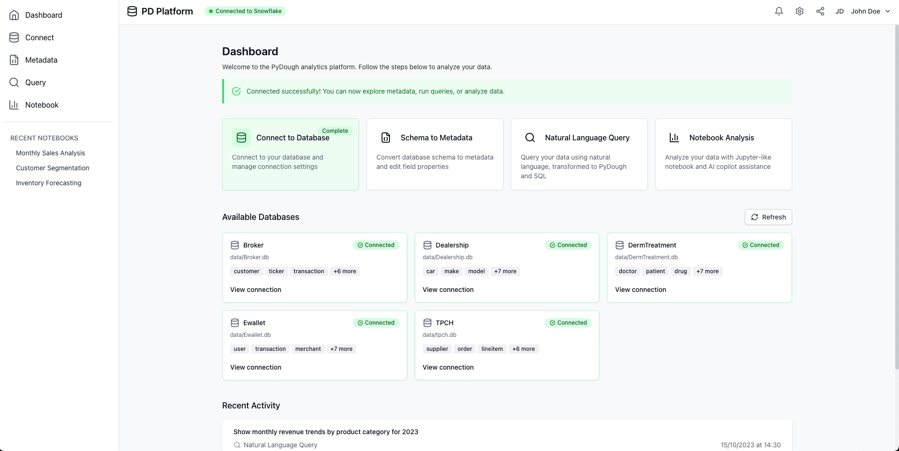
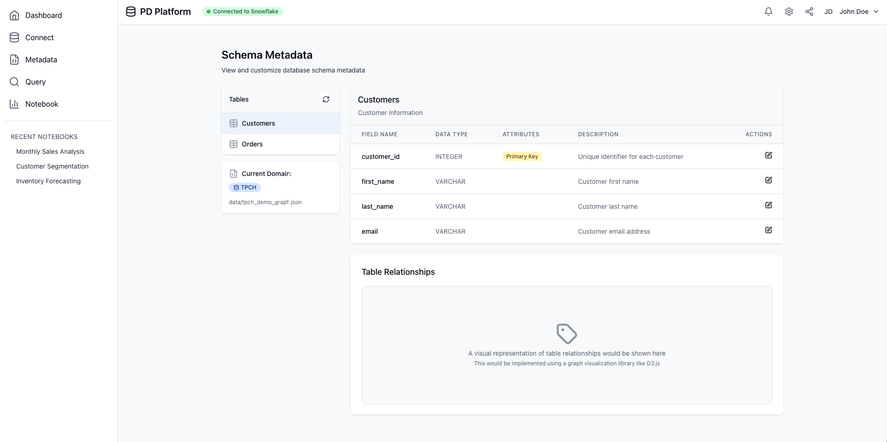
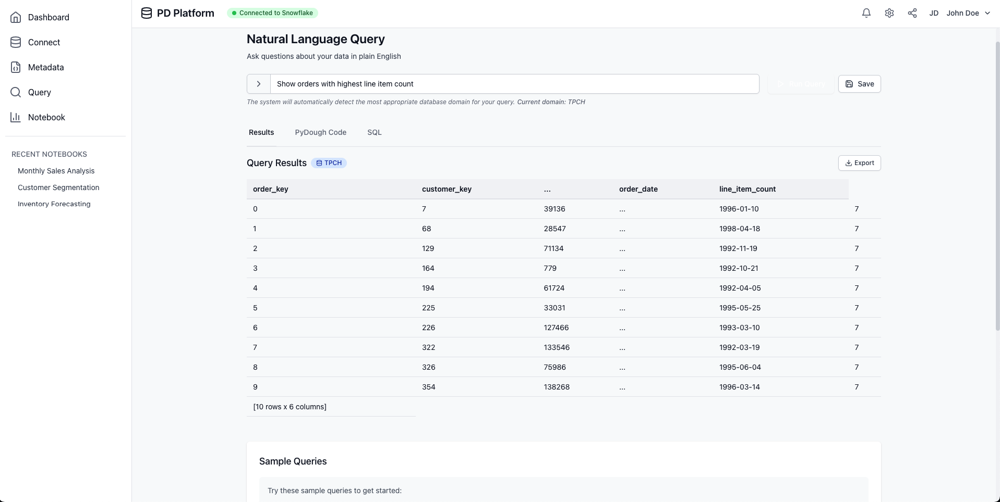
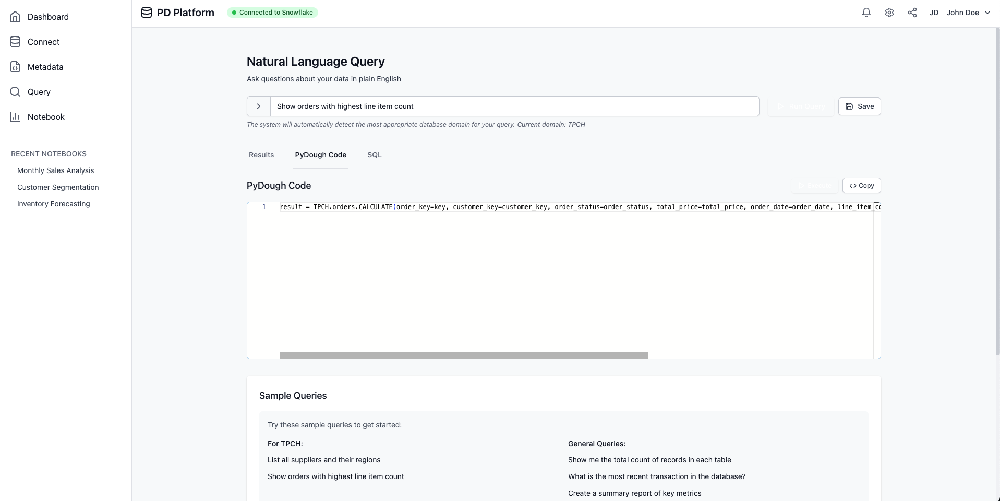
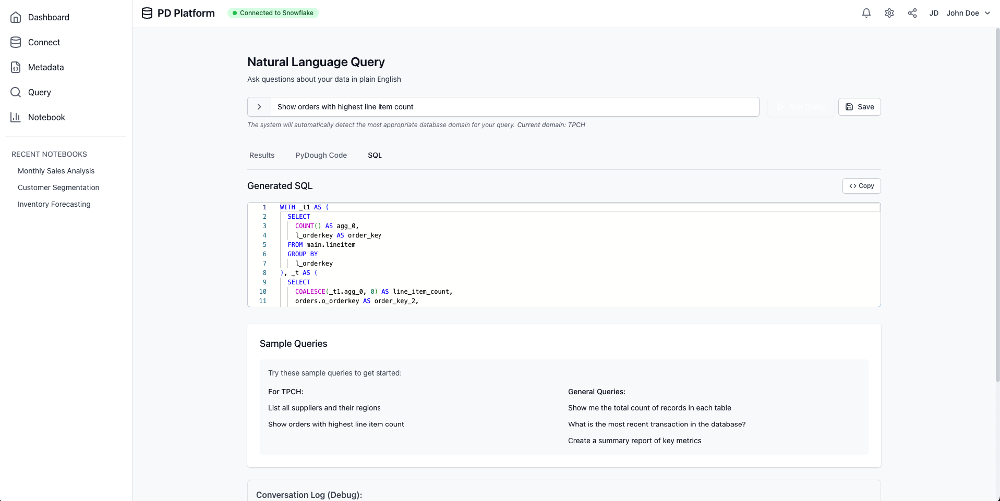

# PyDough Platform

A web interface for interacting with the PyDough query processor. This platform transforms natural language queries into PyDough code and then into SQL, enabling database analysis using Large Language Models (LLMs).

## Features

-   **Natural Language Querying:** Ask questions in plain English.
-   **Multi-Domain Support:** Connect to and query databases from various domains (e.g., Broker, Dealership, TPCH).
-   **Schema Visualization:** View metadata for the selected database schema.
-   **Code Generation:**
    -   Generates PyDough code from your natural language query.
    -   Translates PyDough code into SQL.
-   **Query Execution:**
    -   Execute the generated PyDough and SQL.
    -   View query results directly in the interface.
-   **Tabbed Interface:**
    -   **Results Tab:** Displays query output, supporting both plain text and HTML table formats.
    -   **PyDough Code Tab:** Shows the generated PyDough code.
    -   **SQL Tab:** Shows the generated SQL query.
-   **Interactive Controls:**
    -   Auto-execution toggle for PyDough and SQL.
    -   Clear conversation history.
    -   Select different data domains.
-   **Query History:** Saves and manages your past queries and their results within a session.
-   **(Backend) Structured LLM Output:** Ensures more reliable code generation.
-   **(Backend) LLM-based Domain Detection:** Automatically identifies the relevant data domain for your query.
-   **(New) Robust Response Parsing:** Enhanced extraction techniques ensure PyDough code is reliably captured from various LLM response formats.
-   **(New) Improved Error Handling:** Better handling of errors during code generation and execution.
-   **(New) Naming Consistency:** Fixed naming inconsistencies between backend and frontend (snake_case vs. camelCase).
-   **(New) SQL Parsing:** Improved extraction of SQL queries from execution results.

## Screenshots

Here's what the platform looks like.

**1. Main Query Interface:**
   

**2. Metadata Display:**
   

**3. Results Display (Table Example):**
   

**4. PyDough Code Display:**
   

**5. SQL Code Display:**
   

## Project Structure

-   `src/`: React frontend (Vite + TypeScript)
    -   `components/`: Reusable UI components
    -   `context/`: React context for application state (e.g., `AppContext.tsx`)
    -   `pages/`: Main application pages (e.g., `Query.tsx`)
-   `text_to_pydough/`: Python backend (Flask API and Query Processor)
    -   `data/`: Contains database schema (`.json`) and metadata (`.md`) files. **Note:** Large database (`.db`) files are not included in the repository due to size limits and must be obtained or generated separately.
    -   `app.py`: Flask API server.
    -   `pydough_query_processor.py`: Core LLM, PyDough, and SQL generation logic.
    -   `langgraph_impl.py`: Optional LangGraph implementation for structured conversation flow.
    -   `requirements.txt`: Python dependencies.
-   `start.sh`: Script to run both frontend and backend concurrently.
-   `.gitignore`: Specifies intentionally untracked files (like `.db` files, `venv`, `.env`).
-   `README.md`: This file.

## Prerequisites

-   **Node.js:** v18 or later (for the frontend - check `package.json` for engine specifics).
-   **Python:** 3.11 or later (for the backend - check `text_to_pydough/venv` setup).
-   **Git:** For cloning the repository.
-   **LLM API Key:** A Google Gemini API key is required for the backend query processing. You can get one from [Google AI Studio](https://ai.google.dev/).

## Setup Instructions

1.  **Clone the Repository:**
    ```bash
    git clone <repository-url> # Replace <repository-url> with the actual URL
    cd PD-platform
    ```

2.  **Set Up Frontend:**
    ```bash
    # From the project root directory (PD-platform)
    npm install
    ```
    This installs all necessary Node.js packages listed in `package.json`.

3.  **Set Up Backend:**
    ```bash
    cd text_to_pydough
    python3 -m venv venv # Create a virtual environment (e.g., python3.11 -m venv venv)
    source venv/bin/activate # Activate the environment (use `venv\\Scripts\\activate` on Windows)
    pip install -r requirements.txt # Install Python packages
    cd .. # Return to project root
    ```

4.  **Configure Gemini API Key:**
    You need to provide your Gemini API key to the backend. The `llm` library is used for key management.

    *   Ensure your backend virtual environment is active:
        ```bash
        cd text_to_pydough
        source venv/bin/activate
        ```
    *   Set your Gemini API key:
        ```bash
        llm keys set gemini
        ```
        Paste your API key when prompted. The key will be stored securely by the `llm` tool.
    *   (Optional) You can verify the key by listing them:
        ```bash
        llm keys list
        ```
    *   Deactivate the environment if you're done with backend setup for now:
        ```bash
        deactivate
        cd .. # Return to project root
        ```
    *   Alternatively, the application *may* fall back to an environment variable `GEMINI_API_KEY` if set in `text_to_pydough/.env`, but using `llm keys set gemini` is recommended.

5.  **Obtain Database Files:**
    -   The large `.db` files needed for the different data domains (e.g., `tpch.db`, `Broker.db`) are **not** included in this repository due to size constraints and are listed in `.gitignore`.
    -   You will need to place the required `.db` files into the `text_to_pydough/data/` directory for the application to connect to them. Ensure the filenames match those expected by the domain configurations (e.g., `tpch_demo_graph.json` references `tpch.db`).

## Running the Application

The easiest way to run both the frontend and backend is using the provided script from the **project root directory (`PD-platform`)**:

1.  **Make the script executable (if needed, typically a one-time step):**
    ```bash
    chmod +x start.sh
    ```

2.  **Run the script:**
    ```bash
    ./start.sh
    ```

This script will:
-   Start the Python Flask backend (usually on `http://127.0.0.1:5001`).
-   Start the Vite React frontend development server (usually on `http://localhost:5173`).
-   Attempt to open the application in your default web browser.

**Alternatively, run Frontend and Backend Separately:**

*   **Backend:** (In one terminal, from the project root)
    ```bash
    cd text_to_pydough
    source venv/bin/activate # Activate virtual environment
    python app.py
    # Backend will typically run on http://127.0.0.1:5001
    ```

*   **Frontend:** (In a separate terminal, from the project root)
    ```bash
    npm run dev
    # Frontend will typically run on http://localhost:5173
    ```
    Then open the frontend URL (e.g., `http://localhost:5173`) in your browser.

## How it Works

1.  **User Interaction:** The user selects a data domain and types a natural language query into the frontend interface.
2.  **API Request:** The frontend sends the query, selected domain, and conversation history (if any) to the backend Flask API (`/api/query` endpoint).
3.  **Backend Processing (`pydough_query_processor.py`):**
    a.  **Domain Identification:** If no domain is explicitly selected, the LLM attempts to detect the domain from the query.
    b.  **Schema Loading:** The backend loads the relevant schema information (`.json` and `.md` files) for the identified domain.
    c.  **LLM Prompting for PyDough:** A carefully crafted prompt, including the user query, schema details, and examples, is sent to the LLM (e.g., Gemini).
    d.  **PyDough Generation:** The LLM returns structured output containing the generated PyDough code and an explanation.
    e.  **Robust Extraction:** Multiple approaches are used to reliably extract structured data from the LLM response, improving resilience against various output formats.
4.  **PyDough to SQL (Optional):** If auto-execution is enabled or triggered:
    a.  The generated PyDough code is processed by the PyDough library.
    b.  This process translates the PyDough code into an SQL query.
5.  **SQL Execution (Optional):**
    a.  The generated SQL query is executed against the corresponding domain's database file (e.g., `tpch.db`).
    b.  Results are processed and formatted for frontend display, with improved handling of tabular data.
6.  **Response to Frontend:** The backend sends a JSON response to the frontend containing:
    -   The natural language query.
    -   The generated PyDough code.
    -   The generated SQL query.
    -   The results from SQL execution (if performed).
    -   Any explanations or error messages.
    -   Field names maintain both naming conventions for compatibility: `pydough_code` (snake_case for backend) and `pydoughCode` (camelCase for frontend).
7.  **Frontend Display:** The frontend receives the response and updates the UI:
    -   The "Results" tab displays the query output (as text or a table).
    -   The "PyDough Code" tab displays the generated PyDough code.
    -   The "SQL" tab displays the generated SQL.
    -   The conversation history is updated.

## Development Notes

-   **Repository Hygiene:** Avoid committing large files (like `.db` databases), secrets, or generated files (`venv`, `node_modules`, `dist`, `__pycache__`). Use the `.gitignore` file to prevent this. If you accidentally committed a large file, you may need to remove it from the Git history using tools like [BFG Repo-Cleaner](https://rtyley.github.io/bfg-repo-cleaner/) or `git filter-branch`.
-   **Adding New Domains:**
    1.  Add a new schema definition file (e.g., `new_domain_schema.json`) to `text_to_pydough/data/`.
    2.  Add a corresponding metadata/description file (e.g., `new_domain.md`) to `text_to_pydough/data/`. This file provides natural language descriptions of collections and properties to the LLM.
    3.  Place the actual database file (e.g., `new_domain.db`) in `text_to_pydough/data/`.
    4.  Update the `DOMAINS` dictionary in `text_to_pydough/pydough_query_processor.py` with the new domain's key, display name, schema file, and (optionally) description file.
-   **Branching Strategy:** Use feature branches (`git checkout -b feature/your-feature-name`) for new work and create Pull Requests (PRs) for merging changes into the main branch (e.g., `main` or `develop`).
-   **Linting and Formatting:** Consider adding linters (e.g., ESLint for frontend, Pylint/Flake8 for backend) and formatters (e.g., Prettier for frontend, Black for backend) to maintain code consistency.
-   **Error Handling:** Continuously improve error handling in both frontend and backend to provide informative messages to the user.
-   **Response Format Flexibility:** The backend uses multiple extraction approaches to handle various response formats from the LLM, improving reliability in code extraction.

## Recent Improvements

### Backend Enhancements
- **Structured Response Parsing**: Multiple fallback mechanisms to extract code from LLM responses in different formats
- **Consistent API Response Format**: Added both `pydough_code` (snake_case) and `pydoughCode` (camelCase) for compatibility across backend and frontend
- **Enhanced Schema Information**: Improved schema information included in LLM prompts to generate more accurate PyDough code, including collection names and key properties
- **Improved Error Handling**: Better handling of errors during code generation and execution with informative messages
- **SQL Parsing**: Enhanced extraction of SQL queries from execution results

### Frontend Improvements
- **Tabular Data Handling**: Better rendering of SQL query results as formatted tables
- **Error Message Display**: Improved visualization of error messages
- **Responsive UI Components**: Enhanced layout and responsiveness of UI components

## Technology Stack

### Frontend
- **Framework**: React 18 with TypeScript
- **Build Tool**: Vite 5.4+
- **UI Components & Styling**:
  - Tailwind CSS 3.4 for styling
  - Monaco Editor for code display
  - Lucide React for icons
  - React Hot Toast for notifications
  - React Markdown for rendering markdown content

### Backend
- **Language**: Python 3.11+
- **Web Framework**: Flask 2.3+ with Flask-CORS
- **Data Processing**:
  - Pandas 2.1+ for data manipulation
  - PyDough 0.1+ for database query DSL
- **LLM Integration**:
  - LLM 0.25+ (Simon Willison's LLM library)
  - LLM-Gemini 0.19+ for Google Gemini integration
  - Supported models: Gemini 2.5 Pro Preview, Gemini 2.0 Flash
- **State Management**:
  - LangGraph 0.0.24+ for improved conversational workflow (optional)
  - LangChain Core for structured message handling
- **Data Validation**: Pydantic 2.4+
- **Environment Management**: python-dotenv 1.0+

### Database
- SQLite databases (.db files) for different domains (e.g., TPCH, Broker, Dealership)

### Project Structure
- `src/`: React/TypeScript frontend
  - Components, context, pages
- `text_to_pydough/`: Python Flask backend
  - Natural language to PyDough to SQL processing
  - Domain detection via LLM
  - API endpoints for query processing
- `data/`: Schema files (JSON) and database files (SQLite)

### Development & Build Tools
- **Package Management**: npm (Node.js)
- **Linting**: ESLint 9.9+
- **Type Checking**: TypeScript 5.5+
- **CSS Processing**: PostCSS 8.4+, Autoprefixer 10.4+

### Deployment
- Development mode: `start.sh` script runs both frontend and backend
  - Frontend on http://localhost:5173
  - Backend on http://localhost:5001

### Authentication & Security
- Requires Google Gemini API key for LLM functionality
- Key management via LLM CLI tool or environment variables

## LangGraph Integration

The PyDough platform includes an optional LangGraph implementation that provides improved state management and conversational workflow. This implementation offers several advantages:

### Features

- **Structured State Management**: Maintains conversation history and domain context between turns
- **Clear Workflow Definition**: Uses a graph-based approach to define the query processing pipeline
- **Improved Domain Detection**: More reliable domain detection with error handling
- **Enhanced Code Generation**: Better prompting for PyDough code generation
- **Streaming Responses**: Support for streaming responses during interactive mode

### Usage

1. **Install LangGraph Dependencies**:
   ```bash
   cd text_to_pydough
   ./setup_langgraph.sh
   ```

2. **Use Interactive Mode with LangGraph**:
   ```bash
   python langgraph_interactive.py
   ```

3. **Use the LangGraph API Endpoint**:
   Send POST requests to `/api/query-lg` with the following format:
   ```json
   {
     "query": "Your natural language query",
     "execute": true,
     "domain": "optional_domain_name",
     "history": [
       {"role": "user", "content": "previous query"},
       {"role": "assistant", "content": "previous response"}
     ]
   }
   ```

### Implementation Details

The LangGraph implementation includes:

- `langgraph_impl.py`: Core graph definition with nodes for domain detection, code generation, and execution
- `langgraph_interactive.py`: Interactive CLI using the LangGraph implementation
- `requirements-langgraph.txt`: Dependencies for LangGraph functionality

You can check if LangGraph is available via the `/api/status` endpoint, which includes a `langgraph_available` field.

## Troubleshooting Common Issues

### LLM Response Parsing
If you encounter issues with code generation, check the backend logs for debugging information. The system uses multiple fallback mechanisms to extract code from LLM responses:
1. Direct structured response parsing via Pydantic models
2. JSON attribute extraction
3. Regex-based extraction
4. Raw response parsing

### Frontend-Backend Communication
Issues with data display might be related to naming inconsistencies. The backend now provides both snake_case and camelCase versions of key properties for compatibility.

### Database Connectivity
Ensure database files are correctly named and placed in the `text_to_pydough/data/` directory. The system requires matching between domain configurations and actual file names.

### Performance Considerations
For large datasets, consider adding pagination or limiting the results displayed. The current implementation shows the first 10 rows of query results by default.

